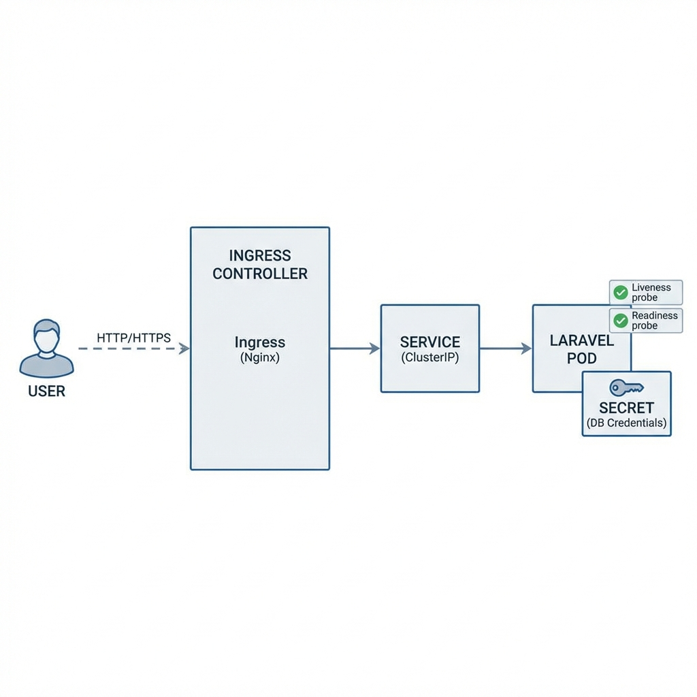

# Laravel on Kubernetes Demo

This repository demonstrates how to deploy a scalable **Laravel Application on Kubernetes**. It includes best practices for configuration management, health monitoring, and security.

## 📂 Repository Configs

| File | Description |
|------|-------------|
| `laravel-deployment.yaml` | Main Kubernetes Manifest (Deployment + Service). Configured with **Liveness & Readiness Probes**. |
| `namespace.yaml` | Defines the isolated `laravel-app` namespace. |
| `create_secret.ps1` | **PowerShell Script** to securely create Kubernetes Secrets from a local `.env` file. |
| `create_secret.sh` | **Bash Script** (for Linux/Mac) to create the same secrets. |
| `laravel-env-file` | Template environment file (Sanitized). **DO NOT** commit real credentials here. |
| `architecture_diagram.md` | Visualization of the cluster architecture. |

## 🏗️ Architecture



*   **Reliability**: Auto-restarts (self-healing) if the app freezes via `LivenessProbe`.
*   **Zero-Downtime**: Traffic is only sent when the app is ready via `ReadinessProbe`.
*   **Security**: Credentials are injected via Kubernetes Secrets, not hardcoded in the image.

## 🚀 How to Deploy

### Prerequisites
- A running Kubernetes cluster (Minikube, EKS, GKE, etc.)
- `kubectl` configured

### Steps

1.  **Create Namespace**
    ```bash
    kubectl apply -f namespace.yaml
    ```

2.  **Generate Secrets**
    *   **Windows (PowerShell)**:
        ```powershell
        .\create_secret.ps1
        ```
    *   **Linux/Mac**:
        ```bash
        chmod +x create_secret.sh
        ./create_secret.sh
        ```

3.  **Deploy Application & Ingress**
    ```bash
    kubectl apply -f laravel-deployment.yaml
    kubectl apply -f ingress.yaml
    ```

4.  **Verify Status**
    ```bash
    kubectl get pods -n laravel-app
    kubectl get ingress -n laravel-app
    ```

### 🌍 Accessing Locally (Ingress)
Since this uses an Ingress Controller, you need to map the domain to your local cluster IP.
1.  Get Minikube/Cluster IP: `minikube ip`
2.  Edit hosts file (`C:\Windows\System32\drivers\etc\hosts` or `/etc/hosts`):
    ```text
    <CLUSTER-IP>  laravel.example.com
    ```
3.  Open browser: `http://laravel.example.com`
